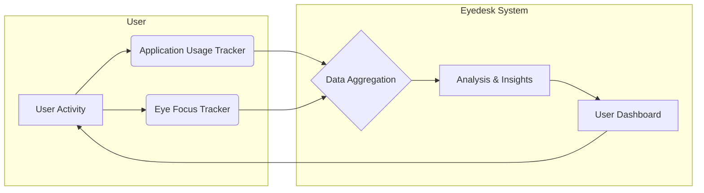
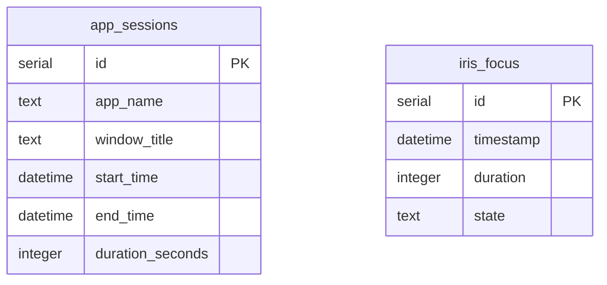
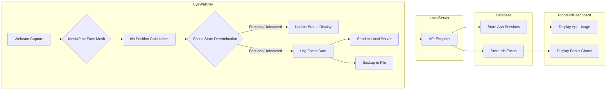

## Project Purpose: Eyedesk - Understanding Work Habits

Eyedesk aims to provide users with a detailed understanding of their work habits by correlating application usage with eye focus. This helps identify patterns, pinpoint productivity bottlenecks, and ultimately improve focus and efficiency.

### Core Functionality

The system tracks two primary data streams:

1.  **Application Usage:** Records which applications are active and for how long.
2.  **Eye Focus State:** Monitors whether the user's eyes are focused or unfocused.

By combining these datasets, Eyedesk can reveal insights into how different applications or tasks affect user focus.



### Data Model

The core data is stored in two main tables: `app_sessions` and `iris_focus`.

*   **`app_sessions`**: Logs application usage with `app_name`, `window_title`, `start_time`, and `end_time`.
*   **`iris_focus`**: Records eye focus state with `timestamp`, `duration`, and `state` ('focused' or 'unfocused').



### Example Data Flow

The `db/mock_data.sql` file provides sample data demonstrating typical work patterns. For instance, it shows periods of deep work with high focus interspersed with meetings or communication, which often lead to unfocused states.

**Example: Deep Work Session**

```sql
-- Afternoon deep work (best focus)
INSERT INTO iris_focus (timestamp, duration, state) VALUES
('2024-01-15 13:00:30', 330, 'focused'),
('2024-01-15 13:07:00', 390, 'focused'),
('2024-01-15 13:14:30', 450, 'focused');
```

**Example: Communication Period**

```sql
-- Communication period (more unfocused states)
INSERT INTO iris_focus (timestamp, duration, state) VALUES
('2024-01-15 10:15:30', 300, 'unfocused'),
('2024-01-15 10:17:00', 90, 'focused'),
('2024-01-15 10:20:00', 180, 'unfocused');
```

This correlation allows Eyedesk to highlight when specific applications might be contributing to focus loss or sustained concentration.

# eyedesk Key Features

eyedesk is a comprehensive application designed to enhance productivity by tracking user activity and eye focus. It monitors active application windows, uses webcam and MediaPipe for eye focus detection, logs application sessions and focus states, and provides a web-based dashboard for data visualization.

## Core Functionality

eyedesk operates by continuously monitoring user activity and eye gaze. This data is then processed and stored for later analysis and visualization.

### Application Window Tracking

The system keeps a record of active application windows, noting the application name and window title. This allows for detailed analysis of how time is spent across different software.

**Database Schema:**
The `app_sessions` table stores this information.

```sql
CREATE TABLE IF NOT EXISTS app_sessions (
  id INTEGER PRIMARY KEY AUTOINCREMENT,
  app_name TEXT NOT NULL,
  window_title TEXT,
  start_time DATETIME NOT NULL,
  end_time DATETIME,
  duration_seconds INTEGER GENERATED ALWAYS AS (
    CASE
      WHEN end_time IS NOT NULL THEN strftime('%s', end_time) - strftime('%s', start_time)
      ELSE NULL
    END
  ) STORED
);
```

**Mock Data Example:**
This data simulates a typical workday with various applications.

```sql
INSERT INTO app_sessions (app_name, window_title, start_time, end_time) VALUES
('code', 'server.ts - eyedesk - Visual Studio Code', '2024-01-15 09:00:00', '2024-01-15 09:25:00'),
('chrome', 'Documentation - TypeScript', '2024-01-15 09:25:00', '2024-01-15 09:35:00');
```

### Eye Focus Monitoring

Using a webcam and MediaPipe, eyedesk tracks the user's eye focus. This involves analyzing facial landmarks to determine if the user is looking at the screen.

**Core Logic:**
The `core/eye-watcher/app.py` script handles webcam capture and MediaPipe integration.

```python
# Capture webcam
cap = cv2.VideoCapture(0)
fps = cap.get(cv2.CAP_PROP_FPS) or 30.0

# Tighter threshold for horizontal center detection
CENTER_ANGLE_VERTICAL = 20  # Vertical center threshold

# Alert settings
ALERT_FRAMES = 45  # About 1.5 seconds at 30 fps
off_center_count = 0
```

**Focus State Visualization:**
The system provides real-time visual feedback on focus status.

```python
    # Display FOCUSED or UNFOCUSED status
    if is_focused:
        status_text = "FOCUSED"
        status_color = (0, 255, 0)  # Green
        bg_color = (0, 100, 0)  # Dark green background
    else:
        status_text = "UNFOCUSED"
        status_color = (0, 0, 255)  # Red
        bg_color = (0, 0, 100)  # Dark red background

    # Draw status box at the top
    cv2.rectangle(frame, (0, 0), (w, 80), bg_color, -1)
    text_size = cv2.getTextSize(status_text, cv2.FONT_HERSHEY_SIMPLEX, 2.0, 3)[0]
    text_x = (w - text_size[0]) // 2
    cv2.putText(
        frame, status_text, (text_x, 60), cv2.FONT_HERSHEY_SIMPLEX, 2.0, status_color, 3
    )
```

**Database Schema:**
The `iris_focus` table logs these focus states.

```sql
CREATE TABLE IF NOT EXISTS iris_focus (
  id INTEGER PRIMARY KEY AUTOINCREMENT,
  timestamp DATETIME NOT NULL,
  state TEXT NOT NULL -- "focused" | "unfocused"
);
```

**Mock Data Example:**
This data simulates periods of focused and unfocused states.

```sql
INSERT INTO iris_focus (timestamp, duration, state) VALUES
('2024-01-15 09:00:00', 0, 'focused'),
('2024-01-15 09:03:30', 210, 'focused'),
('2024-01-15 09:08:45', 315, 'unfocused');
```

### Session and Focus Logging

All application usage and eye focus data are logged for detailed analysis. This includes start and end times for application sessions and timestamps with states for focus events.

**Data Flow:**
The `core/eye-watcher/app.py` script sends focus data to a local server and logs it to files as a backup.



### Web-Based Dashboard

A frontend dashboard provides a visual representation of the collected data, allowing users to review their productivity and focus patterns.

**Dashboard Components:**
The dashboard includes statistics, focus charts, and application session tables.

```typescript
// frontend/src/components/Dashboard.tsx
export function Dashboard() {
  // ... mock data loading ...

  return (
    <div className="space-y-6 p-4">
      <h1 className="text-3xl font-bold">Productivity Dashboard</h1>

      {/* Stats Overview */}
      <StatsOverview sessions={mockAppSessions} focusData={mockIrisFocus} />

      {/* Main Content Grid */}
      <div className="grid gap-6 lg:grid-cols-2">
        {/* Focus Chart */}
        <DotFocusChart focusData={mockIrisFocus} />

        {/* Additional Stats or Charts */}
        <div className="space-y-6">
          {/* Placeholder for more components */}
        </div>
      </div>

      {/* App Sessions Table */}
      <AppSessionsTable sessions={mockAppSessions} />
    </div>
  );
}
```

**Key Dashboard Metrics:**
The `StatsOverview` component summarizes key productivity metrics.

```typescript
// frontend/src/components/StatsOverview.tsx
export function StatsOverview({ sessions, focusData }: StatsOverviewProps) {
  // ... calculations for total duration, focus percentage, etc. ...

  const stats = [
    {
      title: "Total Screen Time",
      value: formatDuration(totalDuration),
      description: "Across all applications",
      icon: Clock,
      color: "text-blue-600",
    },
    {
      title: "Focus Rate",
      value: `${focusPercentage}%`,
      description: `${focusedCount}/${focusData.length} focused events`,
      icon: Eye,
      color: "text-green-600",
    },
    // ... other stats
  ];

  return (
    <div className="grid grid-cols-1 gap-5 sm:grid-cols-2 lg:grid-cols-4">
      {stats.map((stat) => (
        <Card key={stat.title}>
          <CardHeader className="flex flex-row items-center justify-between space-y-0 pb-2">
            <CardTitle className="text-sm font-medium">{stat.title}</CardTitle>
            <stat.icon className={`h-4 w-4 ${stat.color}`} />
          </CardHeader>
          <CardContent>
            <div className="text-2xl font-bold">{stat.value}</div>
            <p className="text-xs text-muted-foreground">{stat.description}</p>
          </CardContent>
        </Card>
      ))}
    </div>
  );
}

## Installation

This section guides you through setting up the eyedesk project. It involves cloning the repository and installing the necessary dependencies for both the frontend and backend components.

### 1. Clone the Repository

First, obtain the project's source code by cloning the repository from GitHub.

```bash
git clone <repository_url>
cd eyedesk
```

### 2. Install Node.js Dependencies

The project utilizes Node.js for its backend server and frontend development. You'll need to install dependencies for both the root directory and the frontend sub-directory.

**Root Directory Dependencies:**

Navigate to the root of the cloned repository and install the backend dependencies.

```bash
# Using npm
npm install

# Or using yarn
yarn install
```

**Frontend Dependencies:**

Next, navigate to the `frontend` directory and install its specific dependencies.

```bash
cd frontend
# Using npm
npm install

# Or using yarn
yarn install
```

### 3. Install Python Dependencies

The `core/eye-watcher` component is built with Python. Install its required libraries using pip.

```bash
cd ../core/eye-watcher
pip install -r requirements.txt
```

This completes the initial setup. You are now ready to explore and run the eyedesk project.

---

### Project Structure Overview

This diagram illustrates the primary directories and their roles within the eyedesk project.

```mermaid
flowchart LR
    A[eyedesk Repository] --> B(core)
    A --> C(frontend)
    A --> D(db)

    subgraph Core Components
        B --> B1[activity-watcher.js]
        B --> B2[eye-watcher]
        B --> B3[server.ts]
    end

    subgraph Frontend
        C --> C1[src]
        C --> C2[vite.config.ts]
        C --> C3[eslint.config.js]
        C1 --> C1a[App.tsx]
        C1 --> C1b[main.tsx]
        C1 --> C1c[components]
        C1 --> C1d[types.ts]
        C1 --> C1e[data]
    end

    subgraph Database
        D --> D1[focus.db]
        D --> D2[mock_data.sql]
    end

    B2 --> B2a[app.py]
    B2 --> B2b[requirements.txt]

    classDef core fill:#1A202C,stroke:#2D3748,stroke-width:2px,color:#E2E8F0
    classDef frontend fill:#2D3748,stroke:#4A5568,stroke-width:2px,color:#E2E8F0
    classDef db fill:#1F2937,stroke:#374151,stroke-width:2px,color:#E2E8F0

    class B,B1,B2,B3 core
    class C,C1,C2,C3,C1a,C1b,C1c,C1d,C1e frontend
    class D,D1,D2 db
    class B2a,B2b core
